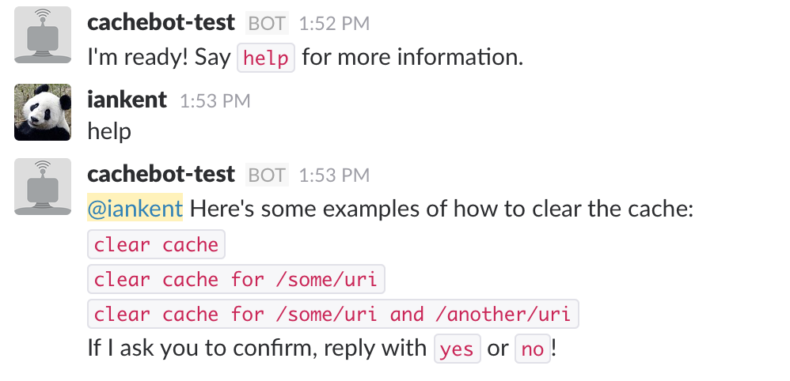

cachebot
========

A [Slack](https://slack.com/) bot for [CloudFlare](https://www.cloudflare.com/).



### Configuration

Configure cachebot using environment variables:

| Environment variable | Description
| -------------------- | -----------
| AUTHORISED_USERS     | Users authorised to use cachebot
| CF_TOKEN             | CloudFlare API token
| CF_EMAIL             | CloudFlare account e-mail
| CF_ZONE              | CloudFlare Zone ID
| RESTRICTED_CHANNELS  | Channels which require an authorised user
| SLACK_TOKEN          | Slack API token
| URL_BASES            | Base URL(s), comma separated
| URL_SUFFIXES         | URL suffixes, comma separated

### Usage

1. Start cachebot
2. `/invite` cachebot to a channel
3. Ask cachebot to clear your cache:
  - `clear cache`
  - `clear cache for /some/uri`

### Authorised users / restricted channels

By default, cachebot will allow any user to clear the cache.

With a restricted channel set, access is restricted to a set of authorised users.

For example, if you have a channel with guest users in, you can limit use of
cachebot to specific named users.

Example:

```bash
# Only 'foo' and 'bar' users can use cachebot in the 'support' channel.
# cachebot works as normal in all other channels.
AUTHORISED_USERS=foo,bar
RESTRICTED_CHANNELS=support
```

### License

Copyright ©‎ 2016, Ian Kent (http://iankent.uk).

Released under MIT license, see [LICENSE](LICENSE.md) for details.
